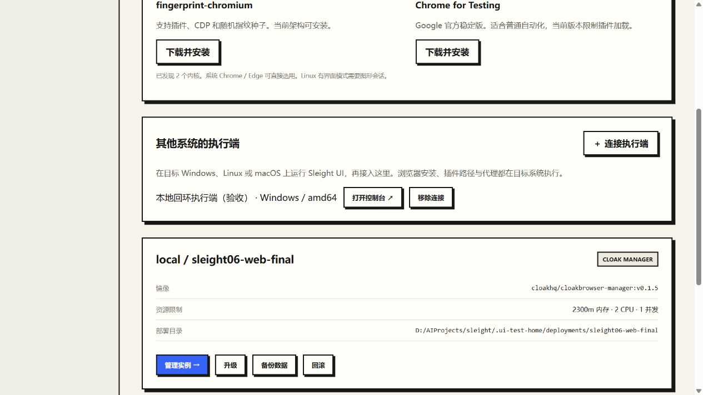
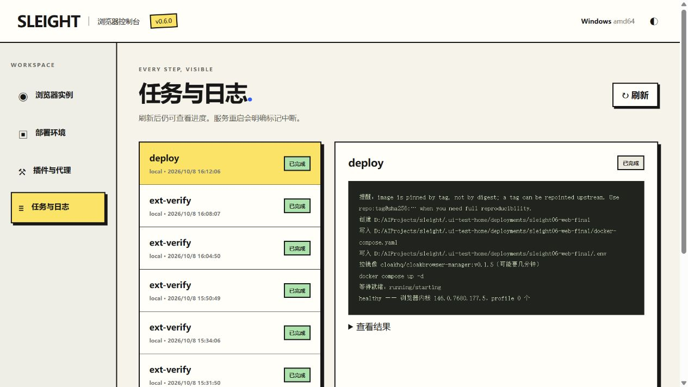
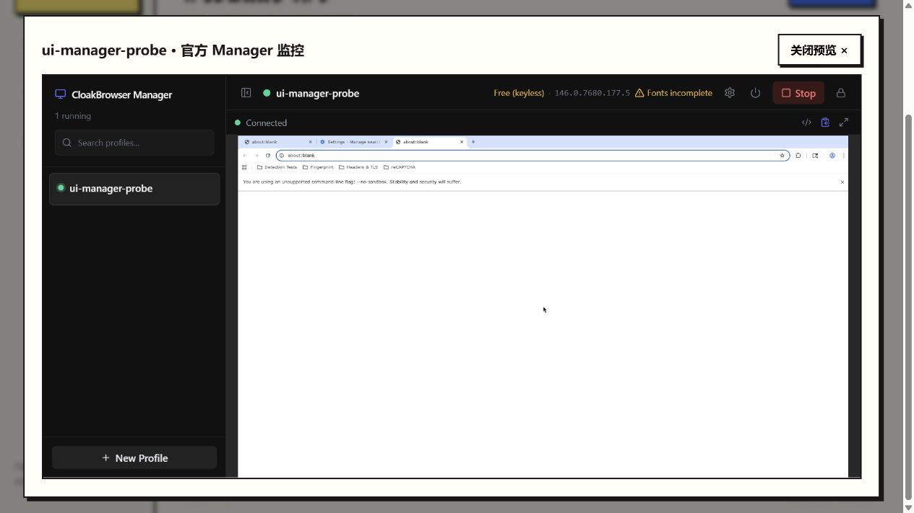
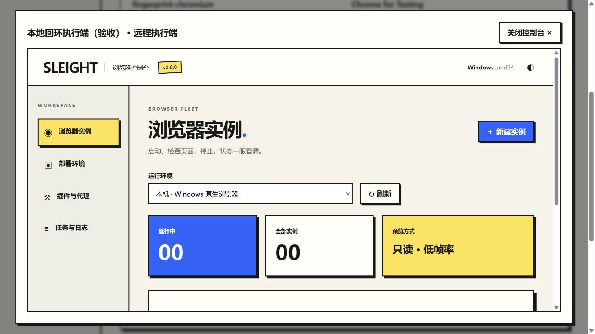

# 历史报告：服务化改造前的 0.6 验收

以下是之前 Redis 实现的历史记录，不代表本轮交付；当前安装和测试以 `统一服务本地测试报告.md` 为准。

# Sleight 0.6、pyp、fin 本地验收

验收日期：2026-10-08。代码已实现，生产环境尚未部署。

## 验收结果

| 范围 | 结果 | 实际验证内容 |
| --- | --- | --- |
| Sleight 离线回归 | 984 passed、2 skipped、72 deselected | SDK、API、鉴权、部署、容量账本、失败恢复、SQLite 并发、反代静态资源 |
| 标准 Chrome 集成 | 35 passed、1 skipped | CDP、页面交互、OOPIF、console、快照、VNC WebSocket 包装兼容性 |
| 原生 Windows 浏览器 | 1 passed | fingerprint-chromium 150、真实 HTTP 代理、MV3 页面效果及插件清单、JPEG 预览、进程回收 |
| 原生 Linux 浏览器 | 1 passed | 在本地 Linux Docker 独立 venv 安装 wheel、实际下载安装 fingerprint-chromium 150，再验证同一插件／代理／预览／回收契约 |
| Redis 服务器 | 2 passed | 独立本地 Redis 的真实租约；容量治理另由下列 Manager 测试覆盖 |
| 官方 Manager v0.1.5 | 4 passed | 新 API、CDP、启动限额、真实插件、浏览器退出后的 driver 回收、强杀与 TTL、清理失败保留容量并重试 |
| 旧版升级与数据回滚 | 1 passed | v0.0.10 → v0.1.5 → v0.0.10；profile ID、Cookie、插件、token、自定义环境变量及网络保留；完整命名卷备份与恢复 |
| 远程执行端 | 1 passed | 实际 HTTP、JS/CSS、SSE、插件清单、官方 VNC WebSocket；GUI 内嵌控制台已可见 |
| Vue 前端 | 7 passed，类型检查及构建通过 | 自定义 binary、错误提示、未检查禁部署、检查前不访问未启动 Manager |
| pyp | 10 passed | 管理员 JWT／专用 cookie、HTTP／JS／CSS／SSE／VNC 反代、权限撤销、WS cookie 到期关闭、导航 migration 幂等及回退 |
| fin 离线 | 1458 passed、1 skipped、16 deselected | 导入前隔离配置，覆盖爬虫框架及新 SDK 适配；网络测试明确排除 |
| fin 真实调用链 | 1 passed | Windows ReutersSpider.run_pool → 本地 Linux Manager；动态 seed、远端插件默认 context、Redis、finally 清理 |
| 包与静态检查 | 通过 | 默认／redis 两个独立 venv 安装；XPath、Web、编译资产、CLI；wheel／sdist 元数据；Sleight 全部及 pyp／fin 本次相关 Python 文件 Ruff |

以上分组有重叠，不能直接相加为不重复测试总数。Linux 原生测试在独立 venv 运行，未替换官方 Manager 的 Python 依赖。

Sleight 离线的 2 项 skip：Windows 不具备 POSIX 权限位、Windows OpenSSH 不支持 ControlMaster。
标准 Chrome 分组里的原生用例需要独立 binary，随后已在 Windows 和 Linux 单独启用并通过。
fin 离线的 1 项 skip 就是真实链路 opt-in，用例随后单独启用并通过。
FastAPI TestClient 与 Uvicorn 测试 WebSocket 后端存在弃用提示，测试无失败。

## GUI 实测

使用本机浏览器实际操作，不以接口成功替代页面显示：

- Windows 原生实例创建、启动、RSS 显示、页面截图、停止及名称确认删除。
- 官方 Manager dashboard／KasmVNC：显示 Connected 与浏览器画面。
- Web 新建 Docker 部署：检查 → 部署 → 任务日志 → 容器 healthy，采用 Docker Desktop 命名卷。
- 远程执行端：连接检查、内嵌控制台完整显示。
- 390 × 844 移动布局及深色按钮对比；测试后已恢复桌面 viewport。

本轮点验发现并修复了 VNC 原生 WebSocket prototype、SQLite 审计并发、部署检查顺序、反代前缀下 JS/CSS 404 四类问题，并新增回归断言。









## 环境与产物

- Windows、Python 3.11.14；Docker Desktop Linux amd64、Engine 29.8.2、Compose 5.5.1。
- Redis 8、PostgreSQL 17，使用专用 localhost 端口和测试数据。
- 官方 Manager：`cloakhq/cloakbrowser-manager:v0.1.5@sha256:eaa08b54f7d30f3512e1f8faa1e457fe340e868af9f76b5f6bad282b3bd7ae2d`。
- Sleight wheel：`dist/sleight-0.6.0-py3-none-any.whl`；fin 同一文件位于 `vendor/`，`uv sync --locked` 使用相对路径。
- wheel SHA-256：`66cd7b8c5b30bdbae782f9440920ee6e52f24a915c7d49c7a7080efb5e87d956`。
- 安装元数据只有 `redis` 一个可选 extra。开发依赖改用 uv dependency group，公开安装形式为 `sleight` 和 `sleight[redis]`。

## 复测入口

在 Sleight：

```powershell
uv sync --locked --group dev
uv run pytest -q -m 'not integration and not manager and not redis and not deploy'
uv run ruff check sleight tests
cd frontend
npm ci
npm test
npm run build
```

真实用例需先建立专用本地 fixture：Manager 19065、Redis 16365、Sleight UI 18700；pyp PostgreSQL 15465。
测试代码内的 localhost/token 为一次性 fixture 配置，不能指向生产环境。
`test_v06_upgrade_live.py` 会创建并自行清理随机测试容器和卷，使用独立端口 19067。

```powershell
$env:SLEIGHT_LOCAL_DOCKER_TEST='1'
$env:SLEIGHT_FIXTURE_URL='http://127.0.0.1:18765/' # 在 Manager 容器内可达的测试 HTTP 服务
uv run pytest tests/test_v06_live.py tests/test_v06_upgrade_live.py tests/test_v06_agent_live.py -q
```

pyp：`python -m pytest tests -q`。fin：`python tools/test_offline.py -q`。
真实 Manager、pyp、执行端用例应按分组串行运行，避免争抢同一个限制为 1 的测试 Manager。

## 验证边界与部署建议

未访问共享生产数据库，未请求 Reuters 实站，未部署线上、未发布 PyPI、未推送 Git。
macOS 已实现平台安装与 framework symlink 处理，仅有离线测试，没有 macOS 实机。
原生认证代理暂不支持；Chrome／Edge 的现代版本限制解包插件，需要插件时使用支持它的 Chromium 内核。

官方 Manager #54 与线上内存症状相符，v0.1.5 含 driver 回收修复；缺少事故日志，不能认定它是唯一根因。
本地 fixture 通过不能保证 Reuters 实站成功率。上线后按 [部署与回滚流程](0.6部署与验收.md) 先做单任务小并发验收。

回滚必须同步恢复旧镜像、Compose、env 和完整 `/data`；不要让旧镜像直接读取迁移后的数据库。
本次只清理自行创建的测试资源，保留开发机原有 Docker 资源和 fin 既有未提交修改。
